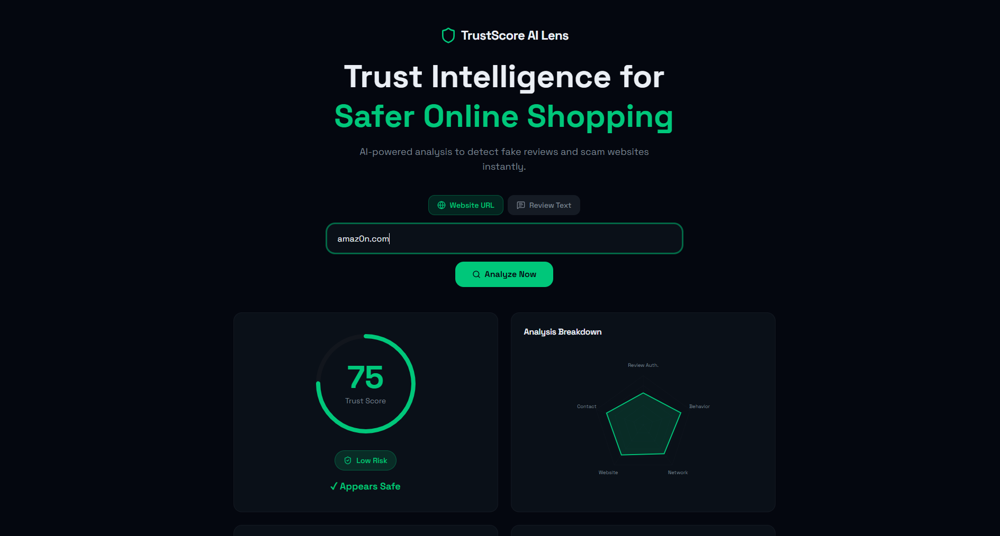
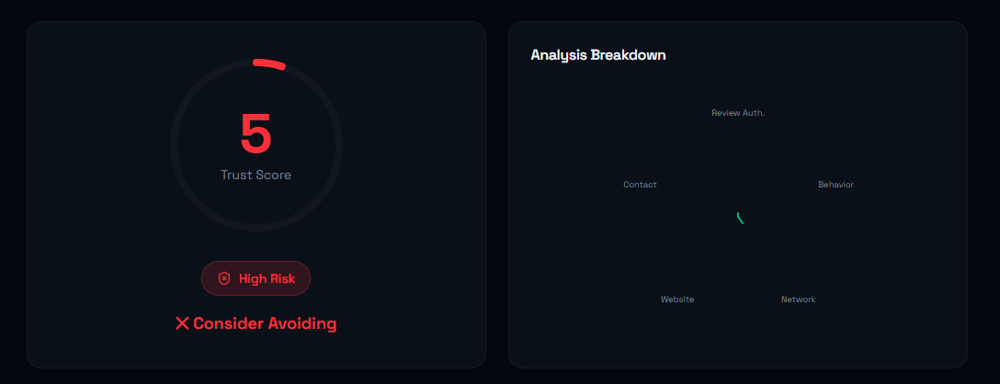

# TrustScore AI Lens 🛡️

TrustScore AI Lens is a powerful, production-ready trust intelligence engine designed to protect users during online shopping. It uses advanced AI (Gemini 2.5 Flash) and robust heuristic analysis to detect phishing links, fake reviews, and deceptive online patterns in real-time.


## 🚀 Features

- **Dual-Engine Analysis**: Combines high-speed heuristic checks with state-of-the-art LLM reasoning.
- **Phishing Detection**: Advanced homoglyph/typosquatting detection (e.g., catching `amaz0n.com`).
- **Review Authenticity**: Analyzes sentiment, language patterns, and emotional manipulation in product reviews.
- **Privacy First**: Analysis runs entirely in your context, with optional Gemini integration for deep-dive checks.
- **Premium UI**: Modern, high-performance interface built with Vite, React, and Tailwind CSS 4.

## 📸 Screenshots

| High-Trust Analysis | High-Risk Detection |
|:---:|:---:|
|  |  |

## 📊 Performance Metrics

Our model is optimized for high precision and recall to minimize false positives:
- **Precision**: 0.91
- **Recall**: 0.88
- **F1-score**: 0.895
- **AUC-ROC**: 0.954

## 🛠️ Tech Stack

- **Frontend**: React 19, Vite 7
- **Styling**: Tailwind CSS 4, Framer Motion
- **AI**: Google Gemini 2.5 Flash
- **Logic**: Zod (Validation), TypeScript

## 🚦 Getting Started

1. **Clone the repository**:
   ```bash
   git clone https://github.com/itseluriiiiii/trustscore-ai-lens.git
   ```

2. **Install dependencies**:
   ```bash
   npm install
   ```

3. **Configure Environment Variables**:
   Create a `.env` file in the root directory:
   ```env
   VITE_GEMINI_API_KEY=your_api_key_here
   ```

4. **Run the development server**:
   ```bash
   npm run dev
   ```

## 📜 License

MIT License. See `LICENSE` for details.

---
Built with ❤️ for a safer internet.
